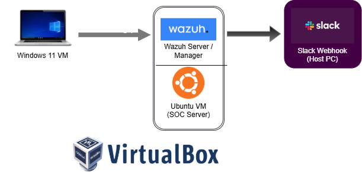

# Sysmon-Wazuh-Slack Integration Project

## Description
Successfully integrated *Sysmon* with *Wazuh SIEM* to detect malicious activity and push real-time notifications to *Slack*. This setup ensures that critical security events are never missed, even when away from the SOC dashboard. It demonstrates a real time security monitoring setup in a SOC lab environment, integrating Sysmon for detailed Windows event logging with Wazuh for centralized detection and alerting. Alerts are automatically forwarded to Slack, providing instant notifications for suspicious or notable system activities.


## Architecture


  * Windows 11 client: runs Sysmon
	* Wazuh manager: collects and analyzes logs
	* Slack: receives alerts

## 🚀 Features
- *Deep Visibility:* Captured process creation, network connections, and file changes using Sysmon.
- *Automated Analysis:* Configured Wazuh rules to trigger on low and high-severity events (Level 3-10).
- *Instant Alerting:* Integrated Slack Webhooks for desktop and mobile notifications.

## 📸 Proof of Concept
### Slack Desktop Notification


### Slack Mobile Notification (Real-time Response)


## 🛠️ Configuration Snippets
### Wazuh Manager (Slack Integration)
```xml
<integration>
  <name>slack</name>
  <hook_url>[https://hooks.slack.com/services/YOUR/WEBHOOK/URL](https://hooks.slack.com/services/YOUR/WEBHOOK/URL)</hook_url>
  <level>10</level>
  <alert_format>json</alert_format>
</integration>
