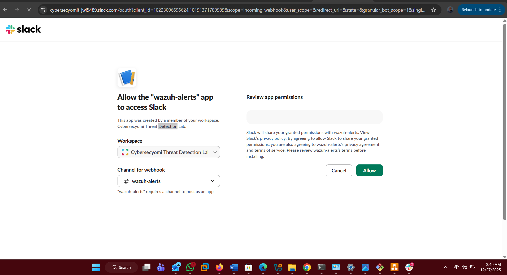
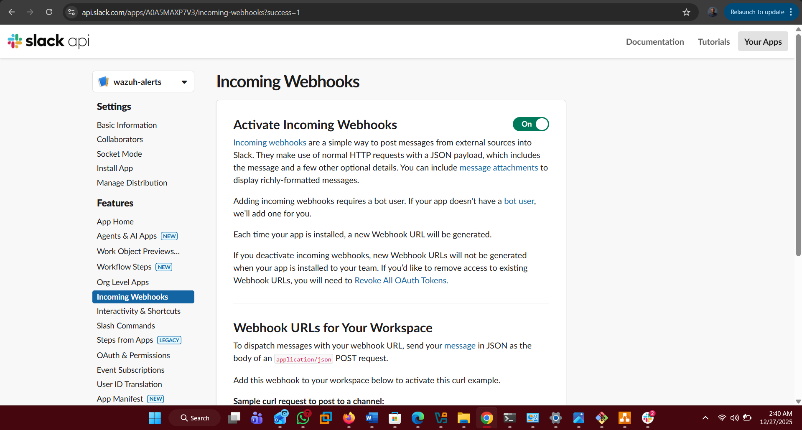
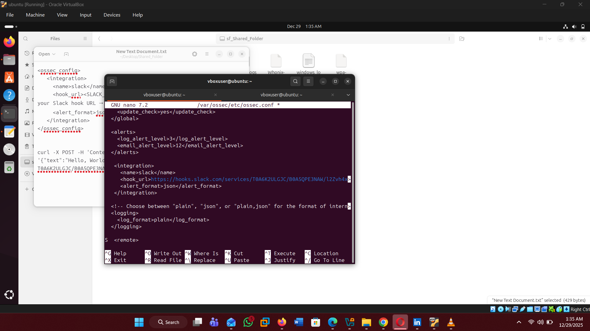
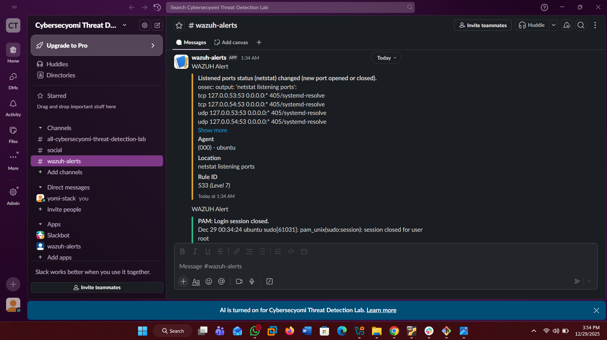
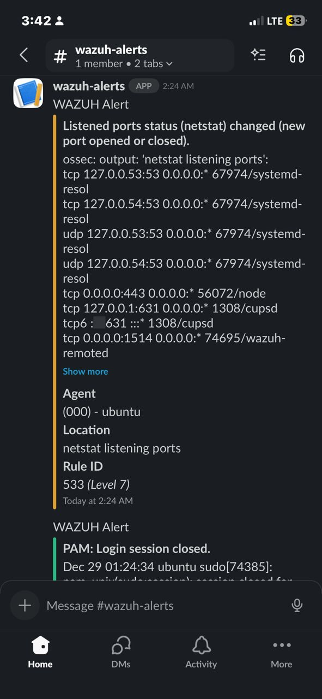
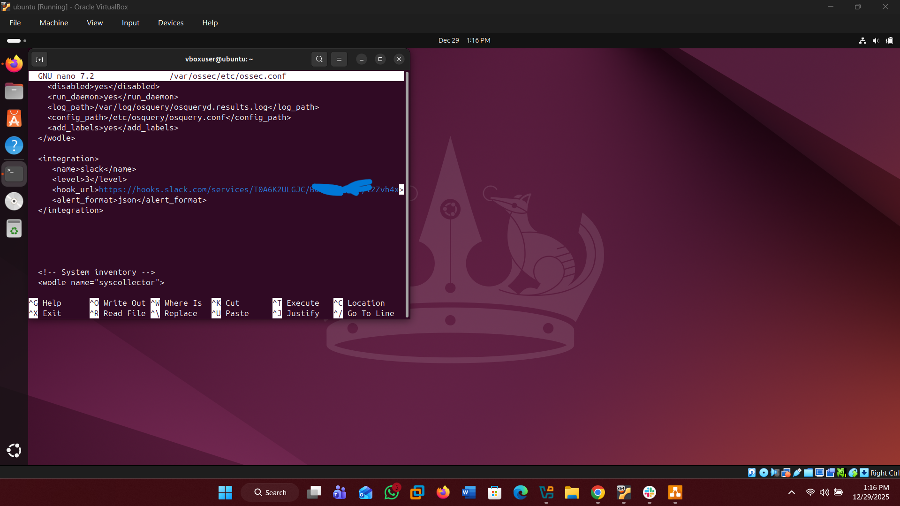
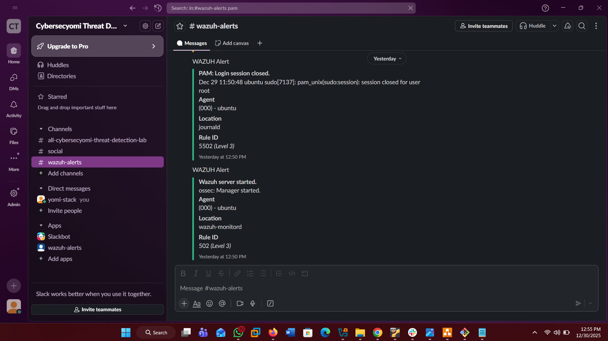
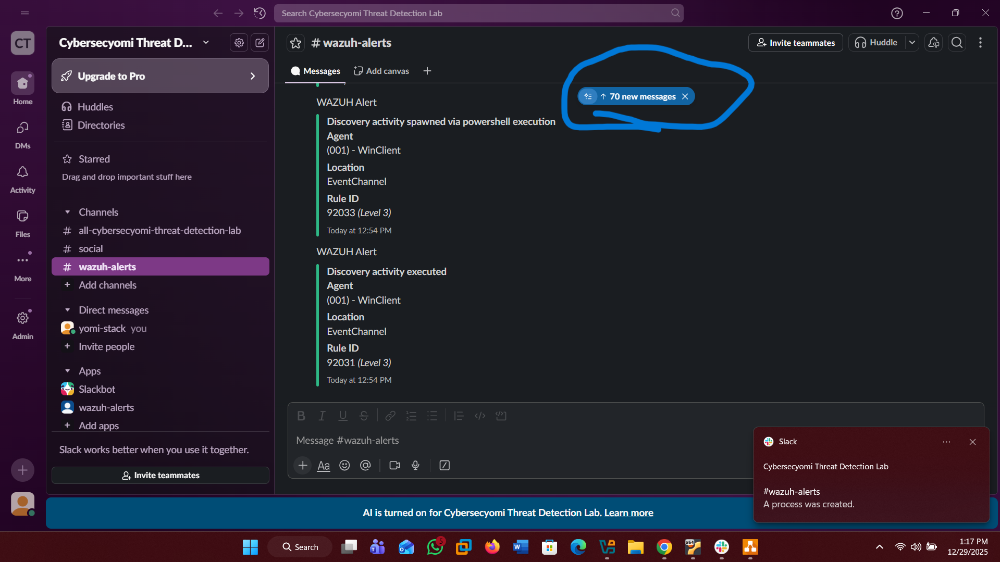
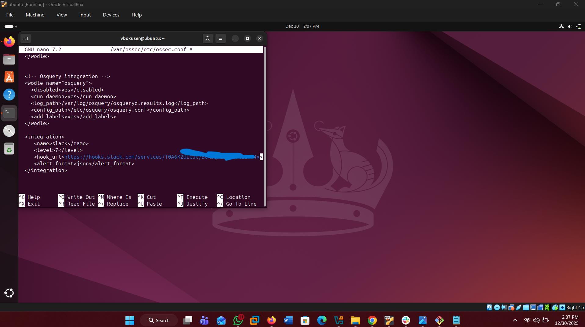
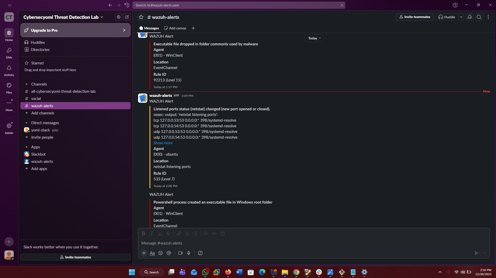

# Sysmon-Wazuh-Slack Integration Project

## Description
I successfully integrated *Sysmon* with *Wazuh SIEM* to detect malicious activity and push real-time notifications to *Slack*. This setup ensures that critical security events are never missed, even when away from the SOC dashboard. It demonstrates a real time security monitoring setup in a SOC lab environment, integrating Sysmon for detailed Windows event logging with Wazuh for centralized detection and alerting. Alerts are automatically forwarded to Slack, providing instant notifications for suspicious or notable system activities.

## Architecture

* *Endpoint (Windows 11):* Sysmon logs granular system activity (process creation, registry changes).
* *Agent:* Wazuh Agent forwards Sysmon event channels to the manager.
* *Manager (Ubuntu):* Decodes logs and matches them against the rule engine.
* *Alerting:* A custom Slack integration triggers via Webhooks when specific rule levels are met.

  
## Features
- *Deep Visibility:* Captured process creation, network connections, and file changes using Sysmon.
- *Automated Analysis:* Configured Wazuh rules to trigger on low and high-severity events (Level 3-10).
- *Instant Alerting:* Integrated Slack Webhooks for desktop and mobile notifications.

## Implementation Steps

### 1. Slack API Configuration
I created a custom Slack application named *"wazuh-alerts"* within my dedicated threat detection workspace.
* *App Permissions:* Authorized the app to post to the #wazuh-alerts channel.

* *Webhook Activation:* Enabled "Incoming Webhooks" to generate a unique URL for the Wazuh manager to post alerts and mapped it to the #wazuh-alerts channel.

### 2. Wazuh Manager Integration
I modified the /var/ossec/etc/ossec.conf file on the Wazuh Manager to enable the Slack integration.

## Evidence of Success: Live Alerting
The integration was validated by monitoring live system events. The screenshots below show the system successfully identifying and forwarding alerts for both manager-level and endpoint-level activity.

### Slack Desktop Notification
* System Health: Received "Wazuh server started" notifications.
* Authentication: Captured "PAM: Login session closed" alerts from the Ubuntu manager.
* Threat Detection: Critical Sysmon alerts including "Evidence of new service creation found in registry" and "A process was created."

### Slack Mobile Notification (Real-time Response)
The integration ensures 24/7 visibility by pushing the same high-fidelity alerts to the Slack mobile application, allowing for a mobile-first response to incidents.

## Optimization & Alert Tuning

### The Challenge: Alert Fatigue
For testing and learning purpose, I configured the Wazuh integration with <level>3</level>. 

While this was useful for verifying that the pipeline was active, it quickly resulted in "Alert Fatigue." As shown in the screenshot below, the Slack channel was flooded with low-priority notifications (such as routine login/logout events and system health checks), making it difficult to identify actual security threats.

### The Solution: Severity Filtering
To align with security best practices and ensure a cleaner, more actionable dashboard, I tuned the integration back to *Level 7*. 

*Why Level 7?*
* *Level 3-5:* Usually informational or low-priority system events.
* *Level 7-10:* Represents suspicious activity or configuration changes.
* *Level 12+:* Represents high-confidence threats (e.g., Mimikatz detection, Malware execution).

By increasing the threshold, I ensured that the team is only interrupted for events that require manual investigation, such as the *"New service creation"* detected by Sysmon.

### Skills Demonstrated
* SIEM Management: Practical experience managing Wazuh Manager and Agent configurations.
* API Integration: Implementing Webhooks for cross-platform communication.
* Endpoint Security: Leveraging Sysmon to go beyond standard Windows Event Logs.
* Linux Administration: Navigating and editing configuration files via CLI on Ubuntu.

### Security Best Practices
* Redaction: The Slack Webhook URL was redacted in this documentation to prevent unauthorized log injection.
* Alert Tuning: While set to Level 3 for lab validation, in a production environment, this would be tuned to Level 7-10+ to reduce "alert fatigue."

## Conclusion
This project successfully demonstrates a fully automated security monitoring pipeline. By bridging the gap between deep endpoint telemetry (*Sysmon), centralized analysis (Wazuh), and real-time communication (Slack*), I created a solution that minimizes the "Time to Detect" (TTD) for critical threats. 

The most significant takeaway from this lab was the balance between *visibility* and *operational efficiency*. Tuning the system from Level 3 to Level 7+ transformed a noisy stream of data into a high-fidelity alerting system, ensuring that security analysts can focus on true incidents rather than routine system logs.

---
This lab was completed as part of my ongoing professional development in Security Operations and Threat Hunting.

## 🔗 Connect with Me
If you have any questions about this project, step-by-step guide or want to discuss SOC automation, feel free to reach out or use the link!

